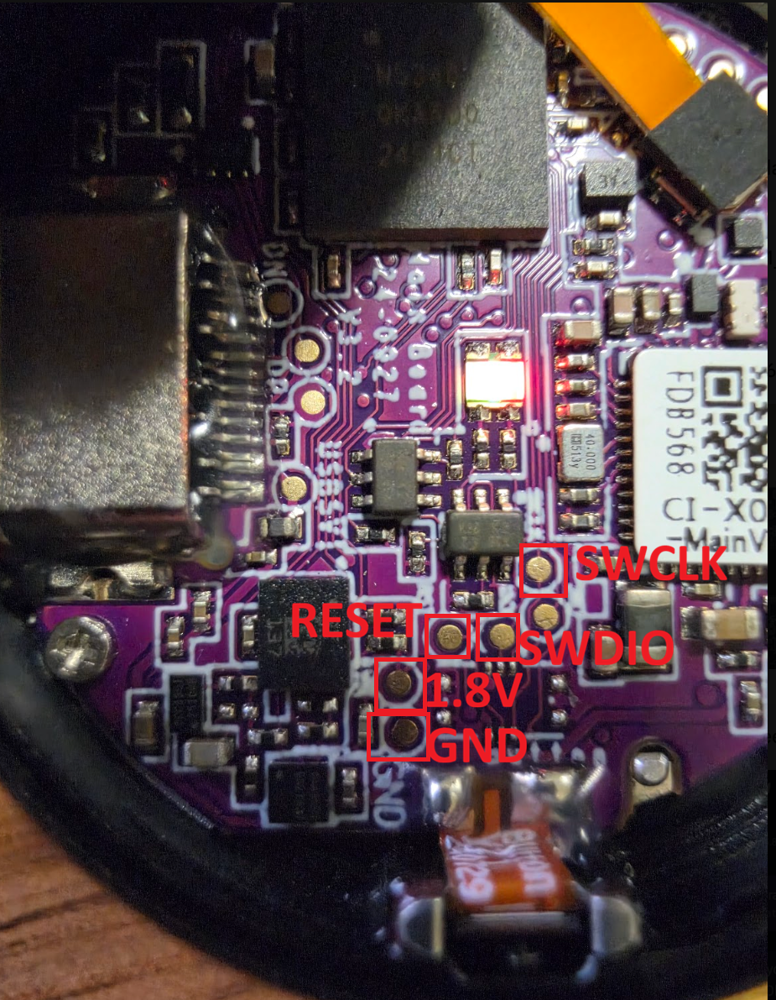

# RePendant — custom firmware for the Limitless Pendant

**Keep your pendant useful. Record locally. Make it your own.**

RePendant is an independent, recreated firmware and Android companion project for
the **Limitless AI Pendant**. The firmware and app currently identify themselves
as **OpenPendant**. No Limitless account or cloud service is required for the
implemented recording, storage and Bluetooth workflows.

Our original code is **free to use, study, modify and redistribute under
Apache-2.0**. Fork it, adapt the controls, change the interface, and build your own
features. Third-party components keep their own licenses; Nordic SDK components
have additional restrictions. This is not an official Limitless product.

> **Experimental developer preview — not a one-click replacement.** Opening and
> flashing the pendant can permanently remove its factory firmware. A complete
> stock restore has NOT been demonstrated. Read the [first-flash guide](docs/FIRST_FLASH.md)
> before connecting a programmer or downloading an image.

[Downloads](https://github.com/COREkunas/RePendant/releases) ·
[First flash & pad photo](docs/FIRST_FLASH.md) · [Build from source](docs/BUILDING.md) ·
[Hardware](docs/HARDWARE.md) · [Known limitations](docs/STATUS.md)

## What works

- Local microphone recording, Opus compression and encrypted NAND storage.
- Long-recording controls from Android or the pendant's physical button, including
  battery-only operation. Five-minute real-microphone battery tests have passed;
  this does not establish unlimited duration or all-day battery life.
- Bluetooth delivery to Android, local playback, expandable recordings, filters,
  and individual/bulk deletion with separate phone/pendant choices.
- Dashboard battery, connection and recording-storage information.
- Configurable status lights, battery profiles and low-power standby.
- Signed application updates over USB **after** custom recovery has been installed.
- Experimental offline whisper.cpp transcription, including Lithuanian, for the
  supported short-clip path. Long-recording transcription remains unfinished.

Current development snapshot: **firmware 0.4.57-battery-settings**, **Android 0.6.49**.
Android requires **Android 8+ and ARM64**. The supplied APK is development-signed,
not a Play Store or production-hardened release. Firmware source targets nRF5340
with nRF Connect SDK v3.4.0 / Zephyr.

The board has **512 MiB physical NAND**; the current recording layout enables
**170 MiB**, not the entire chip. Connection stress cases and fresh-device
provisioning still need work. See the [honest status matrix](docs/STATUS.md).

## Downloads: choose the right artifact

| Artifact | Purpose | Important boundary |
| --- | --- | --- |
| `OpenPendant-0.6.49.apk` | Android companion | Development signing; keep your recovery backup private |
| `RePendant-firmware-0.4.57.zip` | Signed app/radio updates and SWD image components | Custom bootloader trust key required; not a factory USB updater |
| `Limitless-factory-app-1.1.20-research.zip` | Bounded original application image recovered from the owner's backup | Research artifact, **not a complete stock restore**; not Apache-licensed |

Every release includes SHA-256 checksums and component notices. Never flash a
factory research image using the custom firmware's address map. Never flash a
network USB wrapper directly into network-core flash.

## First installation

Initial installation requires access to the PCB's SWD pads and a suitable
**1.8 V-compatible** programmer. The verified setup used an **NXP MCU-Link Base**,
a 10-pin 1.27 mm cable/breakout, common ground, Vref, SWCLK and SWDIO.

The [illustrated guide](docs/FIRST_FLASH.md) gives the pin table, safe power order,
and the network-first installation sequence. **There is not yet a qualified,
general-purpose first-install/provisioning script.** Do not erase a stock pendant
expecting the APK alone to provision it. Help making this reproducible is welcome.

## Source map

- `usb_firmware/` — application, recording/storage/BLE/power logic and sysbuild configuration.
- `independent_firmware/boards/` — nRF5340 board definitions and hardware bindings.
- `android_app/` — Kotlin Android app, native audio/transcription integration and JVM tests.
- `tools/` — dependency checks and offline build helpers.
- `docs/` — hardware, installation, architecture, status and release documentation.
- `LICENSES/` — third-party notices; dependencies are fetched separately.

The implementation uses factory firmware as a behavioral/hardware reference,
not as relocatable code fragments. Opus, Dhara, Zephyr and whisper.cpp provide
reusable upstream components. AI-assisted engineering was used; contributions
and hardware results still need human review and reproducible evidence.

## Contribute

Start with [CONTRIBUTING.md](CONTRIBUTING.md). Particularly useful contributions:
safe first-install tooling, second-device qualification, Bluetooth reliability,
long-recording transcription, storage expansion and measured power optimization.
Do not upload recordings, pairing data, recovery keys or private signing keys.

Limitless, Rewind, Nordic and NXP names identify compatibility/reference hardware;
their owners do not sponsor or endorse this project.

Search terms: Limitless Pendant custom firmware, Limitless AI Pendant alternative,
OpenPendant, nRF5340 wearable voice recorder, offline Android companion,
Bluetooth LE audio, right to repair.
